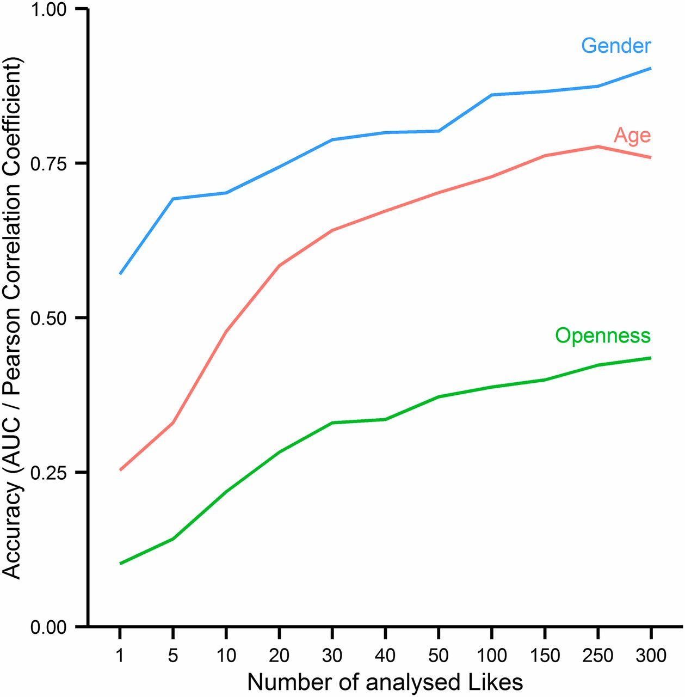

```{=html}
<script>
window.addEventListener('message', function (e) {
  if (e.data && typeof e.data.iframeHeight === 'number') {
    var frames = document.querySelectorAll('iframe');
    frames.forEach(function (f) {
      try {
        if (f.contentWindow === e.source) {
          f.style.height = Math.ceil(e.data.iframeHeight * 1.05) + 'px';
        }
      } catch (err) {}
    });
  }
});
</script>
```


The previous unit laid the foundations of data-protection law: the concept of personal data, the principles of Art. 5 GDPR, the lawful bases of Art. 6, and the heightened regime for special categories under Art. 9. With that groundwork in place, this unit turns to the questions that matter most once artificial intelligence enters the picture. How does the law govern *decisions taken by machines about people*, and how does it govern the *models* themselves, whose appetite for training data collides head-on with the individual-rights architecture of the GDPR? We move from the transparency and control rights of the data subject, through automated decision-making and profiling, into the technical-organisational duties that harden a system, and finally into the frontier where classical data-protection law begins to run out of grip: the AI model.

## Transparency and the rights of the data subject

Where personal data are processed, the controller must lay its cards on the table. Transparency is not a courtesy but a hard-edged legal duty, because it is the precondition for every other right the data subject holds. The transparency principle of [Art. 5(1)(a) GDPR](https://eur-lex.europa.eu/legal-content/EN/TXT/?uri=CELEX%3A32016R0679){target="_blank"} requires that processing be intelligible to the person affected, and [Art. 12(1)](https://eur-lex.europa.eu/legal-content/EN/TXT/?uri=CELEX%3A32016R0679){target="_blank"} insists that information be given in a concise, transparent and plain-language form. Legalese does not discharge the duty.

The GDPR distinguishes two collection scenarios, and the distinction is sharpened, not softened, by AI. Under [Art. 13 GDPR](https://eur-lex.europa.eu/legal-content/EN/TXT/?uri=CELEX%3A32016R0679){target="_blank"} data are gathered directly from the person, and the information must be given at the point of collection. Under [Art. 14 GDPR](https://eur-lex.europa.eu/legal-content/EN/TXT/?uri=CELEX%3A32016R0679){target="_blank"} the data come from elsewhere, and the controller must additionally disclose the *categories* of data and the *source*. This second scenario is precisely the one that large-scale web scraping for model training triggers: the training corpus is not obtained from the people it describes, so Art. 14 governs, and its practical-impossibility exception in Art. 14(5) is read narrowly by supervisory authorities. Compare the two regimes in the interactive figure below.

::: {.widget}
<iframe src="widgets/kapitel-07/widget-information-duties.html" width="100%" height="520px" frameborder="0" style="border:none;" title="Information duties: Art. 13 vs. Art. 14 GDPR"></iframe>
:::

::: {.flip-card}
#### Indirect collection (Art. 14 GDPR)
Data come from other sources, such as an address purchase or web scraping. On top of the Art. 13 information, the controller must disclose the categories of data processed and the source from which they originate.
:::

Once transparency exists, control becomes possible. Articles 15 to 21 equip the data subject with a toolbox of enforceable rights, the counterpart to the controller's duties. The pivotal one is the **right of access** under [Art. 15 GDPR](https://eur-lex.europa.eu/legal-content/EN/TXT/?uri=CELEX%3A32016R0679){target="_blank"}, the door-opener that lets a person check whether processing is lawful at all: it covers confirmation that data are processed, the purposes, the recipients and the storage period, and it carries a right to a free first copy under Art. 15(3). Building on that access, [Art. 16](https://eur-lex.europa.eu/legal-content/EN/TXT/?uri=CELEX%3A32016R0679){target="_blank"} grants **rectification**, and [Art. 17](https://eur-lex.europa.eu/legal-content/EN/TXT/?uri=CELEX%3A32016R0679){target="_blank"} the **right to erasure**, the "right to be forgotten" that Viktor Mayer-Schönberger anticipated as a "virtue of forgetting". Articles 18 and 20 add **restriction** and **data portability**, and [Art. 21 GDPR](https://eur-lex.europa.eu/legal-content/EN/TXT/?uri=CELEX%3A32016R0679){target="_blank"} grants a **right to object** that is especially potent against processing based on legitimate interest: after an objection the controller must demonstrate compelling grounds that override the data subject's interests, or stop.

::: {.case-study}
#### Case: training a foundation model on users' public posts
A social-media company begins to use the vast store of public posts, photos and comments of its users to train its own generative AI models, invoking legitimate interest as its lawful basis. Users protest. What can they do?

::: {.solution}
The **right to object** under [Art. 21 GDPR](https://eur-lex.europa.eu/legal-content/EN/TXT/?uri=CELEX%3A32016R0679){target="_blank"} applies. Because the processing rests on legitimate interest (Art. 6(1)(f)), any user may object to the use of their posts for model training, whereupon the company must cease that processing unless it can show compelling legitimate grounds that override the individual's interests. This is a demanding threshold to meet person by person in a mass-training setting. The case also exposes the deeper problem that recurs throughout this unit: once data have flowed into a trained model, an individual objection or erasure request is technically hard to honour, because the model has already learned from the record rather than merely stored it.
:::
:::

::: {.quick-check}
Which statement about the right of access under [Art. 15 GDPR](https://eur-lex.europa.eu/legal-content/EN/TXT/?uri=CELEX%3A32016R0679){target="_blank"} is correct?

- The controller may refuse access if the person wants the information to prepare an unrelated legal claim.
- The right is limited to structured master data such as name, address and date of birth.
- **The right also covers a free first copy of the data and, in principle, does not require the data subject to show a specific reason for the request.**
- Access may always be denied once data have been used to train a model.
:::

## Automated decisions and profiling (Art. 22 GDPR)

The GDPR reserves a special rule for the situation where a machine, not a human, decides about a person. [Art. 22(1) GDPR](https://eur-lex.europa.eu/legal-content/EN/TXT/?uri=CELEX%3A32016R0679){target="_blank"} grants the right *not to be subject to a decision based solely on automated processing, including profiling*, that produces legal effects or similarly significantly affects the person. The Court of Justice reads this not as a right that must be invoked but as an objective prohibition that bites of its own accord. Two elements are decisive: the decision must be *solely* automated, with no meaningful human involvement in between, and it must have a *significant* effect. Art. 22(2) opens three narrow gateways (contractual necessity, authorisation by Union or Member State law, and explicit consent), and Art. 22(3) then requires safeguards in the contract and consent cases, at minimum the right to human intervention, to express one's point of view and to contest the decision. Art. 22(4) further restricts the use of special-category data.

::: {.flip-card}
#### Profiling (Art. 4(4) GDPR)
Any automated processing of personal data to evaluate personal aspects of a person, in particular to analyse or predict performance at work, economic situation, health, preferences, reliability, behaviour, location or movements.
:::

The reach of Art. 22 was for years contested at the seam between the scoring firm and the firm that uses the score. The Court closed that gap in the SCHUFA ruling. Germany's dominant credit bureau argued that it merely calculated a probability value, while the *decision* was taken later by the bank. The Court rejected the split.

::: {.case-study}
#### Case: SCHUFA and the credit score (C-634/21)
A consumer is refused a loan. The bank relied decisively on a creditworthiness score produced automatically by a credit-reference agency. The agency insists it takes no decision at all, it only computes a number. Is Art. 22 GDPR engaged?

::: {.solution}
Yes. In [C-634/21 (SCHUFA)](https://eur-lex.europa.eu/legal-content/EN/TXT/?uri=CELEX%3A62021CJ0634){target="_blank"} the Court of Justice held that the automated generation of a creditworthiness score is itself an *automated decision* within the meaning of [Art. 22(1) GDPR](https://eur-lex.europa.eu/legal-content/EN/TXT/?uri=CELEX%3A32016R0679){target="_blank"}, provided that a third party such as the bank attaches a *decisive role* to that value. Otherwise a protection gap would open: the scoring agency could point to the bank's downstream act, and the bank could point to the externally supplied score. The Court therefore pulls the decision forward to the moment the score is built. The data subject is entitled to human review and to a meaningful explanation of the logic involved ([Art. 15(1)(h), Art. 22(3) GDPR](https://eur-lex.europa.eu/legal-content/EN/TXT/?uri=CELEX%3A32016R0679){target="_blank"}).

*CJEU (Grand Chamber), 7 December 2023, C-634/21 (SCHUFA), ECLI:EU:C:2023:957.*
:::
:::

The ruling matters for AI ethics because so many machine-learning systems sit exactly in the SCHUFA position: they output a score, a ranking or a risk flag that a nominally human actor then rubber-stamps. Where automation bias hollows out the human step, the "human in the loop" may no longer be a *meaningful* intermediary, and the prohibition of Art. 22 re-attaches. This is also the point at which data-protection law and the EU AI Act converge: the AI Act's duty of effective human oversight for high-risk systems stands *alongside* the data-protection right to human intervention, and the two regimes apply cumulatively.

::: {.drag-exercise}
Under Art. 22 GDPR a person has the right not to be subject to a decision based *solely* on automated processing that has a *significant* effect. In the SCHUFA case the Court treated the *score* itself as the decision, because the bank gave it a *decisive* role.
:::

## Building protection in: Records, Privacy by Design and DPIA

Rights on paper mean little unless the controller can also *show* it complied. This is the accountability principle of [Art. 5(2) GDPR](https://eur-lex.europa.eu/legal-content/EN/TXT/?uri=CELEX%3A32016R0679){target="_blank"}: it is not enough to act lawfully, one must be able to prove it. Three instruments turn that burden into concrete engineering discipline, and all three speak directly to how AI models are built.

The foundation is the **Records of Processing Activities (RoPA)** under [Art. 30 GDPR](https://eur-lex.europa.eu/legal-content/EN/TXT/?uri=CELEX%3A32016R0679){target="_blank"}. Every controller, and in a mirrored, thinner form every processor, must keep a written internal register of each processing operation it carries out: its purposes, the categories of data subjects and of personal data involved, the categories of recipients, any transfers to third countries and the safeguards relied on, the envisaged time limits for erasure, and a general description of the technical and organisational security measures in place. Art. 30(5) exempts organisations with fewer than 250 employees, but the exemption lapses the moment processing is not occasional, touches special categories of data, or is likely to result in a risk to the rights of data subjects, a description that fits almost any AI system that scores, profiles or classifies people. In practice, then, no AI deployer can rely on the small-enterprise carve-out. The register is not paperwork for its own sake: it is the inventory from which the controller works out *which* processing operations are high-risk enough to require a DPIA and *what* Art. 32 security measures they need, and it is the first document a supervisory authority asks to see when it tests whether the accountability principle has actually been discharged. Without an accurate RoPA, neither of the two instruments below has a reliable map of the processing it is supposed to govern.

::: {.flip-card}
#### Records of Processing Activities (Art. 30 GDPR)
A mandatory written register of every processing operation, purposes, data categories, recipients, transfer safeguards, retention periods and a summary of TOMs, that the controller must be able to produce to a supervisory authority on request.
:::

The second instrument is **Privacy by Design and by Default** under [Art. 25 GDPR](https://eur-lex.europa.eu/legal-content/EN/TXT/?uri=CELEX%3A32016R0679){target="_blank"}. It moves protection forward into the design and default-setting phase, rather than bolting it on afterwards. Here the arc back to the ethics units closes: the demand, made with Collingridge and Dignum, that ethical and legal requirements be built in *from the start* becomes an enforceable legal duty. For an AI pipeline this means choosing data-minimising architectures, de-duplicating and filtering training corpora to reduce memorisation, and defaulting to the most privacy-friendly configuration rather than the most data-hungry one.

::: {.flip-card}
#### Privacy by Design (Art. 25(1) GDPR)
Data protection must be embedded from the outset of system design, for instance through strict access restrictions, pseudonymisation, and a data-minimising architecture, rather than added as an afterthought.
:::

The third instrument is the **Data Protection Impact Assessment (DPIA)** under [Art. 35 GDPR](https://eur-lex.europa.eu/legal-content/EN/TXT/?uri=CELEX%3A32016R0679){target="_blank"}. Where a form of processing is likely to result in a *high risk* to the rights of natural persons, in particular where new technologies are involved, the controller must run a structured prior risk assessment: describe the processing, judge its necessity and proportionality, estimate the risks, and set out mitigating measures. The GDPR names three standard triggers, and two of them describe AI systems almost verbatim: the systematic and extensive *evaluation of personal aspects* through profiling or scoring, and the *large-scale processing of special categories* of data. If a high residual risk cannot be tamed by mitigations, the controller must consult the supervisory authority before starting (Art. 36). The DPIA is thus the hinge between abstract risk assessment and concrete safeguards, and a clear forerunner of the risk-based logic that returns in the EU AI Act.

::: {.quick-check}
A start-up with 40 employees runs an AI system that scores job applicants. It assumes Art. 30 GDPR does not apply because it has fewer than 250 employees. Is that correct?

- Yes, the small-enterprise exemption in Art. 30(5) always applies below 250 employees
- **No, because scoring applicants is a systematic evaluation of personal aspects likely to pose a risk to data subjects, so the Art. 30(5) exemption does not apply regardless of headcount**
- No, because Art. 30 only applies to processors, not controllers
- Yes, but only until the start-up has processed data on more than 5,000 applicants
:::

::: {.quick-check}
A company plans an AI system that automatically assesses the creditworthiness of customers (scoring). Which duty is the primary one to examine?

- A breach notification to the supervisory authority under Art. 33 GDPR
- **A Data Protection Impact Assessment under Art. 35 GDPR, because there is a high risk from the systematic evaluation of personal aspects.**
- The appointment of a representative under Art. 27 GDPR
- None, as long as consent has been obtained
:::

Whether a controller must appoint an independent **Data Protection Officer** at all turns on [Art. 37 GDPR](https://eur-lex.europa.eu/legal-content/EN/TXT/?uri=CELEX%3A32016R0679){target="_blank"}: mandatory for public bodies, and for private controllers whose core activity is large-scale systematic monitoring or large-scale processing of special-category data, a description that fits many model providers squarely. Work through a concrete organisation in the decision tree below.

::: {.widget}
<iframe src="widgets/kapitel-07/widget-dpo-obligation.html" width="100%" height="420px" frameborder="0" style="border:none;" title="Decision tree: obligation to designate a DPO"></iframe>
:::

## Security of processing (Art. 32 GDPR)

Design and documentation are inert unless the running system is actually secured. [Art. 32 GDPR](https://eur-lex.europa.eu/legal-content/EN/TXT/?uri=CELEX%3A32016R0679){target="_blank"} requires controllers and processors to implement appropriate *technical and organisational measures* (TOMs) to guarantee a level of security appropriate to the risk. The Regulation names pseudonymisation and encryption, the ability to ensure confidentiality, integrity, availability and resilience, rapid restoration after an incident, and a process for regularly testing the measures. TOMs bundle two layers: *technical* measures act on the system itself (encryption), while *organisational* measures govern the behaviour of the people involved (an access-authorisation concept that limits access to what is necessary). The benchmark is the "state of the art", a deliberately dynamic standard: what suffices today may be inadequate tomorrow, as specific encryption schemes age.

::: {.flip-card}
#### Pseudonymisation vs. anonymisation
Pseudonymisation only *masks* the link to a person and can be reversed with a separately held key, so the data remain personal. Anonymisation removes the link *irreversibly*, so the GDPR no longer applies.
:::

For an AI model these measures take on a distinctive shape. Confidentiality is not only about locking the training corpus behind encryption and access control; it is also about preventing a trained model from *leaking* what it has absorbed. Explore how the abstract protection goals translate into concrete measures across an AI-model pipeline in the widget below.

::: {.widget}
<iframe src="widgets/kapitel-07/widget-toms-security.html" width="100%" height="620px" frameborder="0" style="border:none;" title="Security measures and protection goals for an AI pipeline"></iframe>
:::

## Data protection for AI models

Everything so far assumed the comfortable case in which data subject and data source coincide: I disclose *my* data, and I exercise control over *my* data. AI models strain that assumption to breaking point. This final section confronts the four pressure points where the individual-rights architecture of the GDPR begins to lose grip.

### Training data: lawful basis and provenance

An AI model is only as lawful as the data it was trained on. Because personal data in a training corpus are typically not collected from the people themselves, the lawful basis is almost always legitimate interest under Art. 6(1)(f) GDPR, which demands the three-step test of legitimate interest, necessity, and a balancing in which the data subject's interests must not override. Provenance therefore becomes a compliance artefact in its own right: a controller who cannot document *where* the training data came from and *on what basis* they were lawful cannot discharge the accountability principle, and cannot honour the Art. 14 duty to disclose the source. The EU AI Act reinforces this from the product-safety side, requiring data governance and representative, appropriately vetted datasets for high-risk systems, so that data-protection provenance duties and AI-Act data-governance duties now overlap.

### Memorisation and leakage

Large models do not merely generalise from their training data; they sometimes *memorise* individual records and can be induced to reproduce them verbatim at inference time. A telephone number, an address or a passage of private correspondence that appeared in the corpus can resurface in an output. This turns model security into a data-protection problem that classical IT security never had to face: the risk is not that an attacker breaks into a database, but that the model itself becomes the exfiltration channel. Mitigations sit on both sides of the pipeline: de-duplication and differential privacy during training to blunt memorisation, and output filtering and rate limiting during inference to frustrate extraction. A related and unsettled question is whether the model *weights* themselves constitute personal data; the position that a trained large language model contains no personal reference is contested, and the safer engineering assumption is that memorised content can still make the model a locus of personal data.

### Web scraping at scale

The dominant way to feed a foundation model is to scrape the open web. Public availability, however, is not a lawful basis: the fact that a photo or a post is visible online does not license its use for training, and special-category data that a person has manifestly made public (Art. 9(2)(e)) do not become a free-for-all. Scraping engages the Art. 14 information duty, the Art. 6 balancing test, and the Art. 21 right to object, each of which is difficult to satisfy at web scale. This is exactly why the mass-training case examined earlier is legally fragile: the volume that makes scraping attractive is the same volume that makes individual rights impractical to honour.

### Predictive privacy: the structural blind spot

The deepest challenge is the one that Rainer Mühlhoff calls **predictive privacy**. Modern data processors can *predict* sensitive attributes about a person without ever processing that person's own data, purely from the behaviour of statistically similar others. Mühlhoff distinguishes three generations of privacy attack: intrusion (unlawful direct access), re-identification (linking supposedly anonymous records back to a person), and, from around 2010, prediction, a qualitatively new problem in which an attribute is inferred over someone from reference-group data alone. The classic illustration is the study by Kosinski, Stillwell and Graepel (2013), which showed that Facebook "likes" predict traits like sexual orientation, ethnicity and political affiliation with striking accuracy, from other users' data.

{fig-alt="Horizontal bar chart of area-under-curve values for predicting traits from Facebook likes: ethnicity 0.95, gender 0.93, sexual orientation 0.88, political affiliation 0.85, religion 0.82, and lower values for lifestyle and family variables." width="70%"}

The consequence is that data-protection abstinence no longer protects the individual. Mühlhoff calls this *data permissiveness*: the collective willingness of a community to share data determines the predictive vulnerability of *all* its members, including those who share nothing. The individual-rights instruments of the GDPR run into a wall here. Art. 22 protects against automated decisions based on the *subject's own* data, not against decisions built on reference-group predictions; the personal-data concept of Art. 4(1) may not even be triggered by a purely statistical group prognosis; and data-protection law reaches personal *processing* but not the operation of a model trained on anonymised data, the "anonymity gap". Mühlhoff's answer is a shift from individual to collective data protection: treating derived and inferred information as protected, binding even anonymised training data and trained models to purpose limitation, restricting consent as a basis for population-scale prediction, and creating collective enforcement rights.

{fig-alt="Line chart with prediction accuracy on the y-axis and number of analysed likes on the x-axis; three rising curves for gender, age and openness climb from around 1 like to 300 likes." width="70%"}

### Cross-border transfers: Schrems II

Finally, model training is global, and training data routinely cross the Atlantic to US cloud infrastructure. Here the transfer rules of Chapter V bite. In the Schrems II ruling the Court of Justice invalidated the Privacy Shield adequacy decision because US surveillance law offered no essentially equivalent protection, while keeping standard contractual clauses valid but only on condition that the exporter runs a case-by-case transfer-impact assessment and adds supplementary safeguards where needed.

::: {.case-study}
#### Case: transferring training data to a US cloud (C-311/18)
A European provider wants to train a model on personal data using a US cloud platform, relying on standard contractual clauses. Is that enough after Schrems II?

::: {.solution}
Not on its own. In [C-311/18 (Schrems II)](https://eur-lex.europa.eu/legal-content/EN/TXT/?uri=CELEX%3A62018CJ0311){target="_blank"} the Court held that transfers to a third country must guarantee an *essentially equivalent* level of protection ([Art. 44-46 GDPR](https://eur-lex.europa.eu/legal-content/EN/TXT/?uri=CELEX%3A32016R0679){target="_blank"}). Standard contractual clauses remain a valid tool, but the exporter must carry out a transfer-impact assessment of the actual legal environment in the destination country and, where the clauses cannot ensure equivalent protection against state access, add supplementary measures such as strong encryption, or refrain from the transfer. The later EU-US Data Privacy Framework was designed to address the adequacy gap, but the underlying diligence duty on the exporter remains.

*CJEU (Grand Chamber), 16 July 2020, C-311/18 (Schrems II), ECLI:EU:C:2020:559; benchmark Arts. 7, 8, 47 Charter.*
:::
:::

Taken together, these four pressure points show a legal order built for a world of discrete, attributable records now straining to govern a technology that learns diffuse, collective patterns. The GDPR still applies, but at the frontier of predictive inference its individual-rights logic reaches its structural limit, which is why the debate is moving toward collective and design-based protections, and why the EU AI Act adds a second, product-oriented layer on top.

## From private data to the public sphere

This unit tracked data-protection law from the transparency and control rights of the individual, through the prohibition of purely automated decisions, into the design duties and security measures that harden a system, and finally to the point where AI models test the very premises of the regime. What unites these threads is a tension between individual control and collective, inferential power, a tension that data-protection law manages but does not resolve. That same tension reappears on a societal scale in the next unit, which turns from the private data of the individual to the shared space of the **public sphere**: discourse, disinformation and the synthetic content that unsettles our collective grip on what is real.

## References

### Literature

- Kosinski, M., Stillwell, D. & Graepel, T. (2013): *Private traits and attributes are predictable from digital records of human behavior*. Proceedings of the National Academy of Sciences 110(15), 5802-5805. <https://doi.org/10.1073/pnas.1218772110>
- Mayer-Schönberger, V. (2009): *Delete: The Virtue of Forgetting in the Digital Age*. Princeton University Press, Princeton.
- Mühlhoff, R. (2023): *Predictive privacy: Collective data protection in the context of artificial intelligence and big data*. Big Data & Society 10(1). <https://doi.org/10.1177/20539517231166886>

### Norms & Standards

- Regulation (EU) 2016/679 of the European Parliament and of the Council of 27 April 2016 (General Data Protection Regulation, GDPR), in particular Arts. 4, 5, 6, 9, 12-14, 15-21, 22, 25, 30, 32, 35, 36, 37, 44-46. <https://eur-lex.europa.eu/legal-content/EN/TXT/?uri=CELEX%3A32016R0679>
- Regulation (EU) 2024/1689 of the European Parliament and of the Council of 13 June 2024 (Artificial Intelligence Act), in particular Arts. 10 and 14 (data governance and human oversight for high-risk systems). <https://eur-lex.europa.eu/legal-content/EN/TXT/?uri=OJ:L_202401689>

### Case law

- CJEU, Judgment of 7 December 2023, C-634/21 (SCHUFA Holding), ECLI:EU:C:2023:957: automated credit scoring as an automated decision under Art. 22 GDPR. <https://eur-lex.europa.eu/legal-content/EN/TXT/?uri=CELEX%3A62021CJ0634>
- CJEU (Grand Chamber), Judgment of 16 July 2020, C-311/18 (Data Protection Commissioner v Facebook Ireland and Schrems, "Schrems II"), ECLI:EU:C:2020:559: invalidity of the Privacy Shield; conditions for standard contractual clauses. <https://eur-lex.europa.eu/legal-content/EN/TXT/?uri=CELEX%3A62018CJ0311>
