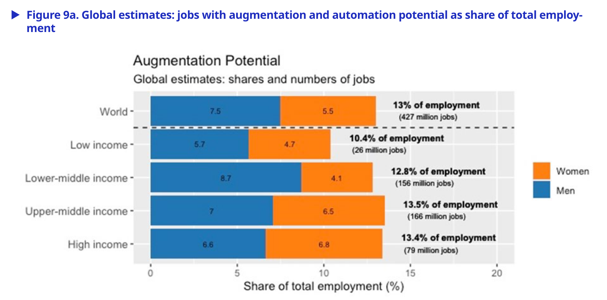
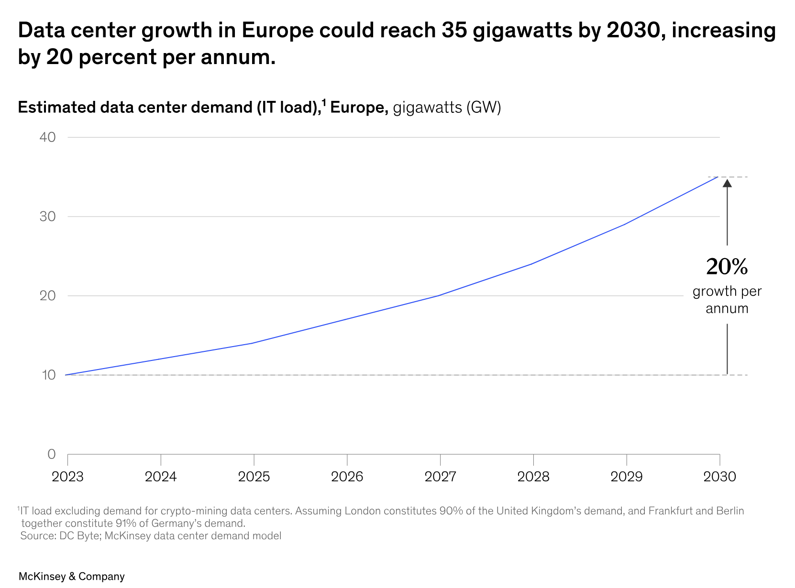

In the previous unit we watched AI reshape the digital public sphere, flooding it with synthetic content and straining the conditions of honest discourse. This unit widens the lens from what AI does *to information* to what it does *to society and to the planet*, asking whether the current AI wave is a genuine transformation of how we work, and at what ecological cost it arrives. We proceed in two parts: first the transformation of work, read through modernization theory and its critics, then the sustainability of AI itself, read through the water and carbon it consumes and the rebound effects it triggers.

## Part 1: AI and the transformation of work

### Transition, transformation and the language of revolution

It helps to fix a distinction at the outset. A **transition** is change *within* given structures, while a **transformation** is a change *of* the structures themselves. Rearranging a factory floor is a transition; the arrival of the factory as such was a transformation. History offers a familiar catalogue of the latter: urbanization, industrialization, the collapse of the Eastern Bloc between 1989 and 1991, and, in our own moment, the twin ongoing transformations that the European Union has made into policy goals, the green transformation toward climate neutrality by 2050 and the open-ended digital transformation. Everyday language tends to inflate such deep shifts into "revolutions", and the question hanging over this unit is whether the AI wave, and generative AI in particular, deserves that word.

::: {.flip-card}
#### Transition vs. transformation
A transition is change within existing structures; a transformation is a change of the structures themselves. Big transformations are what everyday language calls "revolutions".
:::

### Modernization theory: how societies transformed

To judge whether AI is transformative, it helps to have a theory of what made earlier transformations tick. Modernization theory asks how Western societies changed so rapidly and so deeply across the eighteenth, nineteenth and twentieth centuries, and its striking answer is that the causes were not external shocks but a bundle of *internal*, mutually reinforcing trends. The first is **functional differentiation**: the subsystems of society, law, politics, the economy, religion, grow more independent and each develops its own operating logic, which proves more efficient than traditional societies dominated by a single sphere. The second is **mobilization**: individuals, groups and resources such as capital, labour, knowledge and technology become mobile both geographically and across social hierarchies, while the market rises to become the dominant mechanism of distribution. Alongside these run technical and cultural innovation, urbanization and industrialization, and a collective leap in welfare that reshapes institutions, giving us modern universities, healthcare and social-security systems, with equality emerging as a core value.

The third strand concerns **participation and conflict resolution**. As the traditional legitimation of decisions by authority is called into question, societies build institutionalized mechanisms to mediate between their differentiated spheres: parliamentary and party democracy, trade unions and employer associations. In parallel the modern concept of the **citizen** takes shape, defined by equality before the law, a claim to a say in public policy through voting and free opinion, and a right to self-determination in education, work and family life. Read together, these strands describe not a single invention but a self-propelling structural shift, which is exactly the template against which any candidate "AI revolution" must be measured.

::: {.quick-check}
Which pair best captures the core mechanisms of classical modernization theory?

- External conquest and religious unification
- **Functional differentiation and mobilization, with market distribution and expanding participation**
- Central planning and de-industrialization
- Stagnation and the return to traditional authority
:::

### The critiques: alienation, postcolonial extraction, ecological limits

Modernization was never a neutral success story, and four critiques matter for how we read AI. Marxist **historical materialism** argues that the modern subject, and above all the working class, becomes increasingly *alienated* (*entfremdet*) under the exploitative structures of capitalism, estranged from the product and the process of its own labour. **Critical Theory** adds that modernization brings a relentless acceleration that disrupts social ties and uproots people; Hartmut Rosa's diagnosis of the late-modern "society of acceleration" sharpens this point, since technical speed-up promises time yet empirically produces time scarcity, because the pace of life rises in step with efficiency, and digital technologies intensify all of it. The **postcolonial critique** insists that the modernization of the global North was enabled by slavery and the exploitation of colonies in the global South, and that those asymmetric power structures remain in force. The **ecological critique**, finally, points to the ongoing over-use of natural resources and the destruction of the biosphere on which modern growth rests. Each of these will return, unbidden, when we look at how AI transforms work and what it costs the planet.

::: {.drag-exercise}
The claim that the worker is estranged from the product of their labour is the charge of *alienation*; the claim that the North's prosperity rests on exploitation of the South is the *postcolonial* critique; the claim that growth over-uses nature is the *ecological* critique.
:::

### Is AI transformative? White-collar work in the frame

Earlier waves of mechanization hit primarily **blue-collar** jobs. There were indeed mass layoffs in simple manual work, but new professions also arose, demanding different skills and educational profiles. The recurring claim about the current, AI-driven phase is that it will strike primarily **white-collar** office work, reaching the cognitive tasks that earlier automation left untouched. The empirical picture, however, resists both hype and panic. A literature review by Baudchon and Huynh (2025) frames the field around an **evidence paradox**: microeconometric studies routinely find sizeable productivity gains from AI, yet at the macro level those gains are so far barely visible in aggregate growth, echoing the older "productivity paradox" of information technology, which spread from the 1970s but showed up in the statistics only in the 1990s.

Two paradigms structure the debate. The **substitution** view, associated with Acemoglu, distinguishes automation technologies that *replace* tasks from technologies that *reinstate* tasks in new fields, and warns that current AI investment leans heavily toward replacement without an equivalent creation effect, risking structural job loss. The **complementarity** view, associated with Brynjolfsson, holds that AI augments human work, raises productivity and opens new fields, with human-plus-AI "centaur" configurations outperforming either alone, and invokes the *lump-of-labour* fallacy, the observation that technological change has historically created new work despite painful transitions. The task-based literature refines this into a polarization thesis: routine cognitive and manual tasks are most automatable, hollowing out the middle, while high-skill analytical work is complemented and low-skill non-routine manual work resists automation. Generative AI complicates the old story, because it now exposes analytical knowledge work, drafting contracts, code and text, that used to sit safely at the top.

{fig-alt="Horizontal bar chart titled Augmentation Potential, showing global estimates of jobs with augmentation potential as a share of total employment, broken down by income group and by women and men; world figure 13% of employment, 427 million jobs." width="88%"}

### The ILO exposure estimates

The most cited attempt to *quantify* exposure comes from Gmyrek, Berg and Bescond (2023), one of the first substantial analyses of generative AI's effect on jobs, carried out under the auspices of the International Labour Organization. Their method is itself a sign of the times: they sent roughly 25,000 sequential API prompts to GPT-4 to estimate task-level and occupation-level automation scores for the technology, mapped onto the International Standard Classification of Occupations (ISCO-08), and then combined that score matrix with the ILO's global labour-market data. The crucial move is that they separate two kinds of exposure. Some tasks show **augmentation** potential, where AI assists a human who stays in the loop, and some show **automation** potential, where AI could perform the task outright.

The distinction changes the tone of the whole debate. On the ILO's global estimates, the share of employment with high *automation* potential is far smaller than the share with *augmentation* potential, which points toward AI transforming *how* jobs are done more often than eliminating them wholesale. The exposure is also unevenly distributed, and the pattern inverts the usual story of technological disruption: clerical work, historically a route into the paid labour force for women and a large share of employment in richer countries, sits among the most exposed occupations, so the effects fall differently across gender and across income groups.

{fig-alt="Horizontal bar chart titled Automation Potential showing global estimates of jobs with high automation potential as a share of total employment by income group and gender; world figure 2.3% of employment, 75 million jobs, high income 5.1%." width="88%"}

::: {.quick-check}
What is the central finding of the ILO study by Gmyrek, Berg and Bescond (2023)?

- Generative AI will automate a majority of jobs worldwide within a decade.
- **For most jobs, augmentation potential exceeds outright automation potential, and clerical, female-dominated work is especially exposed.**
- Only blue-collar manufacturing jobs are affected by generative AI.
- Exposure to AI is spread perfectly evenly across countries and genders.
:::

### The quality of work, not just its quantity

Counting jobs is only half the ethical question. Even where employment survives, AI can change the *quality* of work, and Bankins and Formosa (2023) supply the framework. Work is meaningful along several dimensions, autonomy, task identity and significance, the use and development of competence, social embeddedness, and a sense of purpose, and AI threatens these along three paths. **Deskilling** occurs when AI absorbs the complex, developing parts of a job and leaves humans the residual, simpler tasks, producing the paradox that more advanced AI can create *simpler* jobs. **De-autonomization** occurs when algorithmic management dictates how, when and where work happens, draining the sense of agency. **Depersonalization** occurs when hiring, evaluation and even dismissal are mediated by systems, stripping work of its intersubjective recognition. The same technology can, in principle, remove tedious or dangerous tasks and augment human judgement, so the outcome is a design choice rather than a technological fate, which is why the constructive answer points back to the value-driven, participatory design we met in earlier units.

::: {.case-study}
#### Case: the AI-augmented paralegal
A mid-size law firm rolls out an AI tool that drafts standard contracts and summarizes case files. Management promises "no layoffs": the paralegals keep their jobs but now mainly review and correct AI output. Junior staff complain that they no longer learn to draft from scratch. Read through the frameworks of this unit, what is happening?

::: {.solution}
On the ILO distinction this is **augmentation**, not automation: the humans stay in the loop, and the head-count is preserved, so a purely quantitative labour-market lens would record no harm. The Bankins and Formosa lens sees the cost the numbers miss. The paralegals face **deskilling**, because the developing part of the task, learning to draft, has migrated to the model, leaving the residual task of correction, which erodes both competence development and task identity. There is a hint of **de-autonomization** too, if the workflow now dictates that every document begins as machine output. The point is that "no layoffs" is not the same as "no harm to the quality of work". A responsible deployment would treat skill development as a design requirement, for instance by rotating juniors through unassisted drafting, rather than optimizing purely for throughput. This is exactly where the earlier units' value-driven design and human-oversight duties do concrete work.
:::
:::

### Ghost work: the human labour inside "automated" AI

The tidiest way to puncture the myth of fully automated AI is to look at who cleans its training data. Generative models rely heavily on human **data trainers** who label content and remove misinformation and harmful material, the hate, violence and abuse imagery that the model must learn *not* to reproduce. This labour is frequently outsourced to low-income countries under precarious conditions. The best-documented case involves workers in Kenya, sometimes called the "Silicon Savannah", engaged through subcontractors to filter toxic content for OpenAI, reportedly for very low pay and with significant psychological toll from constant exposure to disturbing material. This "ghost work" makes the **postcolonial critique** of modernization suddenly concrete: the visible productivity of AI in the global North rests, in part, on invisible, poorly protected labour in the global South, an asymmetry the polished product is designed to hide.

::: {.details}
#### Deep dive: why ghost work is easy to overlook
Ghost work is structurally invisible for three compounding reasons. First, it is *contractually distant*: the labour reaches the model developer through layers of subcontractors, so no single company appears to employ the workers directly, which also diffuses responsibility in the "many hands" sense we met earlier. Second, it is *geographically distant*, performed in jurisdictions with weaker labour protection and far from the users who benefit. Third, it is *rhetorically hidden*, because the marketing language of "automation" and "artificial intelligence" actively obscures the human effort inside the system. Naming the labour is therefore the first ethical step: an honest account of AI's transformation of work has to include the jobs the technology *creates* at its own margins, not only the jobs it augments or replaces at the centre.
:::

## Part 2: AI and sustainability

### Sustainability and the Sustainable Development Goals

The word *sustainability* comes from forestry: a forest is managed sustainably if enough trees are replanted that the forest remains intact despite the harvest, which requires foresight, planning and a willingness to forgo short-term profit to preserve a long-term source of income. Generalized, sustainability means orienting all action so that the natural and social resources we need remain sufficiently available in the future. The central contemporary reference point is the United Nations' **Sustainable Development Goals**, the 17 SDGs adopted in 2016 as part of the 2030 Agenda, which bundle poverty, health, education, gender equality, clean energy, decent work, climate action and more into a shared framework with concrete indicators. The concept is not beyond criticism: some argue it is fundamentally anthropocentric, treating the biosphere as a resource to be exploited so long as continued existence is secured, and economists disputing whether growth and sustainability are compatible at all have proposed *post-growth* or *degrowth* alternatives. For our purposes the SDGs supply the yardstick against which AI's own footprint must be weighed.

### The water footprint of AI

AI's environmental cost is easy to ignore because it is hidden in distant data centres, but the figures are concrete. Li and colleagues (2023) uncovered what they call the "secret water footprint" of AI models, estimating that training GPT-3 consumed on the order of **5.4 million litres of water**. Of this, roughly 700,000 litres went directly to cooling the data centres, while the remainder was consumed upstream, in the supply chain that manufactures the servers and in the generation of the electricity that powers them. The training of a single large model, in other words, drinks a quantity of fresh water more usually associated with heavy industry, and it does so largely out of sight, which is precisely why Li and colleagues argue that the footprint has to be measured and disclosed before it can be governed.

### The carbon footprint of AI

The carbon side is comparably stark. Researchers from Google and UC Berkeley (Patterson et al. 2021) estimated that training GPT-3 caused about **552 tonnes of CO2** and required roughly **1,287 megawatt-hours** of electricity, an amount comparable to the annual electricity consumption of around 320 four-person households. Inference, the everyday use of a trained model, adds its own steady load. A single large-model query is estimated to consume on the order of 0.001 to 0.01 kWh, against roughly 0.0003 kWh for a conventional web search, so an AI query can cost tens of times the energy of the search it often replaces. Multiply that per-query cost by the traffic of a popular service and the aggregate becomes significant. It is this scaling from a tiny per-query number to a very large total that the interactive tool below lets you explore directly.

::: {.widget}
<iframe src="widgets/kapitel-09/widget-footprint-rebound-explorer.html" width="100%" height="900px" frameborder="0" style="border:none;" title="AI footprint and rebound explorer"></iframe>
:::

The macro-trend is heading the wrong way. Modelling by McKinsey suggests that data-centre electricity demand in Europe could reach around **35 gigawatts by 2030**, rising at roughly 20 percent per year, with AI a principal driver. The concern is not any single query but the trajectory of demand at scale, running against exactly the climate targets that the green transformation and the SDGs are meant to secure.

{fig-alt="Line chart showing estimated European data-centre demand in gigawatts rising from about 10 GW in 2023 to about 35 GW in 2030, annotated with 20% growth per annum." width="90%"}

::: {.quick-check}
Roughly how does the energy cost of a single large-model AI query compare to a conventional web search?

- They are essentially identical.
- **The AI query costs on the order of tens of times more energy.**
- The AI query costs less, because models are highly optimized.
- The AI query costs thousands of times less.
:::

### Jevons' paradox: why efficiency need not save the planet

The obvious hope is that engineering will make models efficient enough to shrink the footprint. Here a nineteenth-century insight sounds a warning. In *The Coal Question* (1866), William Stanley Jevons observed that improvements which let a given amount of coal do more work did not reduce coal consumption but *increased* it, because cheaper, more effective use expanded demand faster than efficiency shrank it per unit. This is the **rebound effect**, or **Jevons' paradox**: efficiency gains lower the effective cost of using a resource, which invites more use, which can wipe out or even reverse the expected saving. Applied to AI, a model that is ten times more efficient per query makes AI cheaper and faster to use, which invites far more querying, more products with AI built in, and more ambitious uses, so the aggregate footprint can grow even as each query becomes greener. Efficiency is necessary but not sufficient; without limits on total demand, the "savings" can evaporate.

{fig-alt="Three-row diagram. Top row Innovations: cars that consume less, computer miniaturisation. Middle row Efficiency gains: less petrol costs, reduced costs. Bottom row Rebound: we drive further thanks to savings, we can buy more computers." width="78%"}

::: {.flip-card}
#### Jevons' paradox (rebound effect)
An efficiency gain lowers the effective cost of using a resource, which increases demand for it, so total consumption can stay flat or rise rather than fall. Per-unit greening does not guarantee an aggregate saving.
:::

::: {.case-study}
#### Case: the "green" model upgrade
A large AI provider announces a new model that uses one tenth of the energy per query and markets it as a climate win. Six months later the company's total electricity bill has *risen*. The engineering claim was true, so what happened?

::: {.solution}
This is **Jevons' paradox** in miniature. The per-query efficiency gain was real, but it lowered the cost and latency of using the model, which the company then leveraged: the cheaper model was embedded in more products, offered free to more users, and invoked for longer, more complex tasks such as multi-step "agentic" workflows that fire many queries per request. If demand grows more than tenfold in response to a tenfold efficiency gain, total consumption rises despite the greener per-query number, which is what the rebound slider in the widget above demonstrates. The ethical lesson is that efficiency framed as a *marketing* claim can obscure the aggregate trajectory. Genuine sustainability requires attention to *total* demand, through transparency about footprints (as Li et al. urge), procurement of clean energy, and, more radically, the post-growth question of whether some uses are worth their planetary cost at all. Efficiency without a cap is not a climate strategy.
:::
:::

### Whose transformation, at whose cost?

Both halves of this unit end at the same place. The transformation of work and the ecological footprint of AI are not separate topics but two faces of one question about *distribution*: who reaps the productivity gains, and who bears the costs, whether as deskilled labour, as invisible content moderation in the global South, or as water and carbon drawn from a shared and finite biosphere. The critiques of modernization, alienation, postcolonial extraction and ecological limits, turn out to describe the AI wave with uncomfortable precision. None of this settles whether AI is a transformation worth having; it clarifies the terms on which that judgement must be made. Those terms are exactly what the next unit takes up, turning from diagnosis to response by surveying how the major international organizations have tried to formulate ethical guidelines for AI.

## References

### Literature

- Acemoglu, D. & Restrepo, P. (2022): Tasks, Automation, and the Rise in U.S. Wage Inequality. *Econometrica* 90 (5), pp. 1973-2016. <https://doi.org/10.3982/ECTA19815>
- Bankins, S. & Formosa, P. (2023): The Ethical Implications of Artificial Intelligence (AI) for Meaningful Work. *Journal of Business Ethics* 185 (4), pp. 725-740. <https://doi.org/10.1007/s10551-023-05339-7>
- Baudchon, H. & Huynh, L. (2025): *Productivity, Growth and Employment in the AI Era: A Literature Review*. BNP Paribas Economic Research / BCG Henderson Institute, 9 September 2025.
- Gmyrek, P., Berg, J. & Bescond, D. (2023): *Generative AI and Jobs: A Global Analysis of Potential Effects on Job Quantity and Quality*. ILO Working Paper 96. International Labour Organization, Geneva. <https://doi.org/10.54394/FHEM8239>
- Jevons, W. S. (1866): *The Coal Question: An Inquiry Concerning the Progress of the Nation, and the Probable Exhaustion of Our Coal-Mines*, 2nd ed. Macmillan, London.
- Li, P., Yang, J., Islam, M. A. & Ren, S. (2023): *Making AI Less "Thirsty": Uncovering and Addressing the Secret Water Footprint of AI Models*. arXiv:2304.03271. <https://arxiv.org/abs/2304.03271>
- Patterson, D., Gonzalez, J., Le, Q., Liang, C., Munguia, L.-M., Rothchild, D., So, D., Texier, M. & Dean, J. (2021): *Carbon Emissions and Large Neural Network Training*. arXiv:2104.10350. <https://arxiv.org/abs/2104.10350>
- Rosa, H. (2005): *Beschleunigung. Die Veränderung der Zeitstrukturen in der Moderne*. Suhrkamp, Frankfurt am Main.

### Norms & Standards

- United Nations (2015): *Transforming Our World: The 2030 Agenda for Sustainable Development* (Resolution A/RES/70/1), establishing the 17 Sustainable Development Goals. <https://sdgs.un.org/2030agenda>
