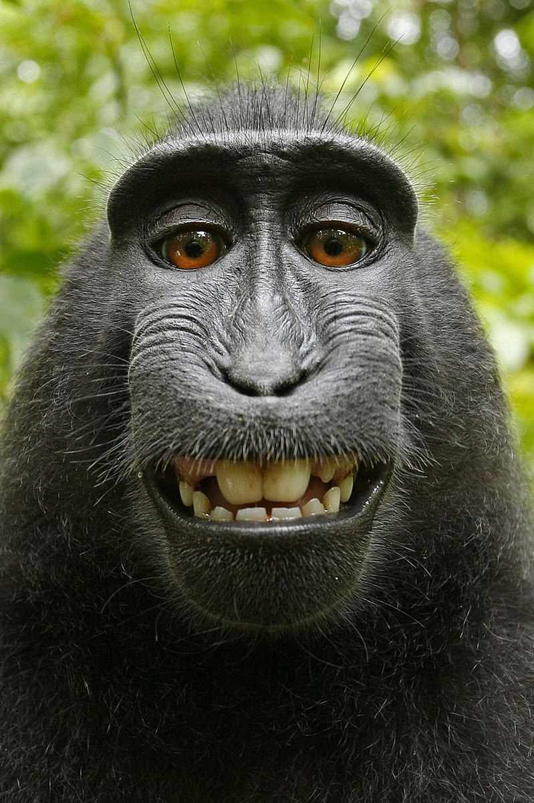
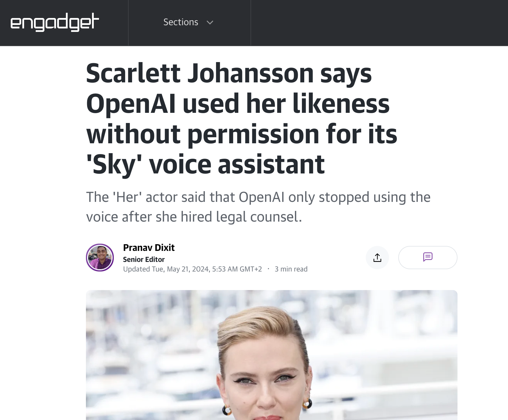
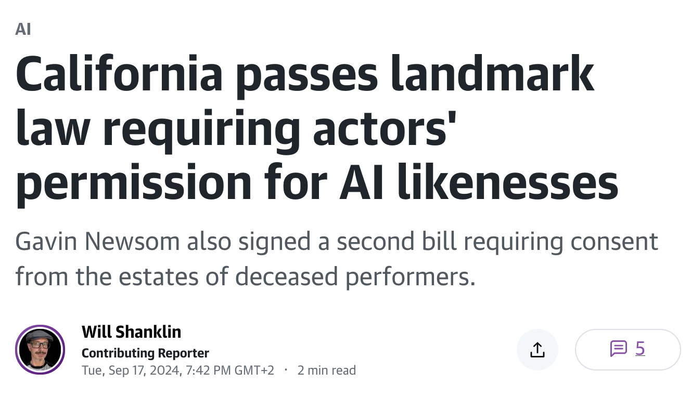

The previous unit closed on a deliberate silence. The EU AI Act, for all its ambition, says nothing about who owns what an AI produces and nothing about who pays when an AI causes harm. It is product-safety and fundamental-rights law, not property law and not civil liability law. This final unit fills those two gaps. We first ask whether the output of a generative model can be owned at all, and on what terms models may be trained on protected material (intellectual property). We then ask who bears the loss when an AI-driven product injures someone (liability). Both questions expose the same underlying tension: a legal order built around human authors and human wrongdoers now has to accommodate systems that generate content and take decisions on their own.

## Copyright and the human author

### What copyright protects, and what it does not

Copyright is the property right of the creative professions. It does not protect the physical object (the book on the shelf) but the intangible intellectual content embodied in it. It sits within the wider field of intellectual property alongside patents (for technical inventions) and trademarks (for signs that distinguish goods). Two functions run through it: a personality-related function, treating the work as an expression of the creator's personality, and an economic function, securing the creator the fruits of their labour by excluding free riders and thereby making a market for art, music and literature possible.

Crucially, copyright never protects the mere idea, only its concrete expression. "A boy attends a school for wizards" is a free idea; the specific text of the novel is protected. Ideas, concepts and scientific findings as such must remain free, or cultural and scientific progress would seize up. This idea/expression divide will matter a great deal when we ask what a prompt actually contributes.

### Four cumulative requirements for a protected work

For a product to count as a *work*, most European copyright systems, following the harmonised EU standard of the "author's own intellectual creation", ask four cumulative questions. First, is it a **personal creation**, that is, does it stem from a human being? Second, does it have **intellectual content**, some communicative or expressive substance beyond mere manual or physical effort? Third, has it taken **perceptible form**, leaving the "workshop of the mind" and becoming perceptible in the outside world? Fourth, and hardest, does it show **individuality** (originality), the "personal stamp" of its creator that lifts it above the everyday? German law, which links these to §2(2) [UrhG](https://www.gesetze-im-internet.de/urhg/__2.html){target="_blank"}, sets the originality threshold famously low (the doctrine of the "small coin"), but the human-creation requirement is not negotiable.

::: {.flip-card}
#### Author's own intellectual creation
The harmonised EU standard of originality: a work is protected only if it results from the author's free and creative choices and bears their personal stamp. Purely technical, mechanical or predetermined output does not qualify.
:::

### Why an AI cannot hold copyright

From the first requirement follows the whole AI-authorship debate. Copyright presupposes a human personal creation, so only a natural person can be an author. A company can never be an author; it acquires only rights of use (licences). The same logic excludes an AI. The point is not novel: courts have long refused protection to output lacking a human creator. The classic illustration is the "monkey selfie", where a photograph taken by a macaque that pressed the shutter itself was held to attract no copyright, because no human made the creative choices.

{fig-alt="Close-up self-portrait photograph of a smiling crested black macaque that triggered the camera shutter itself." width="45%"}

Europe's first court ruling on generative AI made the transfer explicit. In April 2024 the Municipal Court of Prague held that an image a claimant had generated with DALL-E enjoyed no copyright, because the author must be a natural person and the image was not the product of human creation (Municipal Court of Prague 2024). The output was therefore free for anyone to use, including the law firm that had copied it. A German court reached the same result in 2026 for AI-generated logos, treating prompting as a general technical instruction rather than a creative act.

### Prompts and the limits of prompt-based creativity

Consider a concrete output. A user prompts DALL-E 3: "Create a Ninjago comic with the ninja being attacked by Garmadon's motorbike gang." The model returns a polished, on-style image. Is it protected, and if so, for whom?

{fig-alt="AI-generated comic-style image of a green-clad Lego-like ninja riding a motorbike while other ninjas attack, in the visual style of the Ninjago franchise." width="55%"}

On the dominant view, and on the Prague reasoning, entering a prompt is a general instruction: it sets the parameters, but the creative act of giving concrete form lies with the model. Iterative corrections (adjusting colours, fonts, proportions) are treated as craft rather than creation. The interesting frontier is whether *sufficiently* detailed, structured and repeated human choices could eventually cross into protectable authorship. The Prague court did not slam that door entirely, hinting that more targeted, evidenced human instruction might have changed the outcome, and a parallel Beijing decision has gone further in that direction. For now, though, the practical lesson stands: for a routine prompt, no one holds copyright in the output.

::: {.drag-exercise}
Copyright requires a *personal creation* by a human; a purely AI-generated image is therefore *not protected* and falls into the *public domain*. Entering a *prompt* counts as a general instruction, not a creative act that shapes the concrete form.
:::

::: {.widget}
<iframe src="widgets/kapitel-13/widget-originality-check.html" width="100%" height="440px" frameborder="0" style="border:none;" title="Copyright check: is it a protected work?"></iframe>
:::

## Personality rights: the person behind the output

Even where copyright is silent, the *person* depicted or imitated is not without protection. Copyright asks whether an output is a protected work; personality rights ask whether it uses a real person's identity without consent. A voice, for instance, is usually not a "work" (it is not a personal creation in the copyright sense), yet imitating a recognisable voice can still violate the speaker's personality rights.

The point crystallised in 2024, when Scarlett Johansson objected that OpenAI's "Sky" voice assistant sounded uncannily like her, after she had declined an offer to lend her voice. OpenAI withdrew the voice. Whatever the copyright analysis, using a recognisable voice or likeness to evoke a specific person can infringe that person's personality rights independently of copyright.

{fig-alt="Screenshot of an Engadget article headlined 'Scarlett Johansson says OpenAI used her likeness without permission for its Sky voice assistant'." width="60%"}

The same concern drives the film and games industries, where actors fear being replaced by AI-made digital replicas, and where the likeness of deceased performers (the estate of Carrie Fisher, whose image continued to appear in the Star Wars franchise, is a much-cited example) can be reconstructed synthetically. Legislators have begun to respond directly. In September 2024 California passed statutes requiring an actor's permission for AI-generated digital replicas of their likeness and the consent of the estates of deceased performers.

{fig-alt="Screenshot of an Engadget article headlined 'California passes landmark law requiring actors' permission for AI likenesses'." width="60%"}

::: {.quick-check}
An AI voice assistant is trained to sound recognisably like a famous actor who declined to license her voice. On what basis can she object, even though a voice is not a copyright "work"?

- Copyright authorship, because she inspired the output
- **Personality rights, which protect a recognisable voice or likeness independently of copyright**
- The Product Liability Directive
- Nothing, because AI output is always free to use
:::

## Training data: the copyright bottleneck of AI

### From output to input

So far we have looked at the AI *output*. The more consequential copyright question concerns the *input*: models are trained on vast corpora scraped from the internet, much of it protected. That such systems can reproduce an author's or artist's typical style makes it rational to assume the training set contained corresponding protected templates. Building a training corpus involves making copies (reproductions) of those works, and reproduction is a core exclusive right of the author. Training therefore needs a legal basis, either a licence or a statutory exception.

### The text-and-data-mining exception (DSM Directive Arts. 3-4)

That basis, in the EU, is the text-and-data-mining (TDM) exception introduced by the **Directive on Copyright in the Digital Single Market**, [Directive (EU) 2019/790](https://eur-lex.europa.eu/eli/dir/2019/790/oj){target="_blank"} (the DSM or CDSM Directive). TDM means the automated analysis of digital works to extract information about patterns, trends and correlations. The Directive draws a deliberate two-tier structure.

[Article 3](https://eur-lex.europa.eu/eli/dir/2019/790/oj){target="_blank"} creates a strong exception for **scientific research**: research and cultural-heritage institutions may make copies for TDM for research purposes, provided they have lawful access. This exception cannot be waived by rightholders. [Article 4](https://eur-lex.europa.eu/eli/dir/2019/790/oj){target="_blank"} creates a broader exception for **any purpose, including commercial use**: TDM is permitted on lawfully accessible works, but only *unless the rightholder has expressly reserved that use*. For works made available online, that reservation of rights must be expressed in a machine-readable form. Germany transposed the two in [§60d](https://www.gesetze-im-internet.de/urhg/__60d.html){target="_blank"} (research) and [§44b](https://www.gesetze-im-internet.de/urhg/__44b.html){target="_blank"} UrhG (general TDM with a machine-readable opt-out).

The Article 4 opt-out (the "reservation of rights") is the pivot of the entire debate around commercial AI training. Its logic inverts the copyright default: instead of the usual opt-in (nothing may be used without permission), TDM is allowed unless the rightholder actively opts out. The AI Act itself builds on this, requiring GPAI providers to respect such reservations. Yet the mechanism is contested. It is unclear exactly how a machine-readable reservation must be expressed; rightholders rarely declare one, partly because opting out can make a work invisible to search engines; and the scope of the exception is unsettled. A 2026 Munich ruling in a case brought by the German collecting society GEMA against OpenAI suggested that only the building of the training dataset, not the reproduction of works *inside* the trained model, is covered, leaving the reach of the exception genuinely open.

::: {.flip-card}
#### TDM opt-out (Art. 4 DSM Directive; §44b UrhG)
For commercial purposes, including AI training, mining lawfully accessible works is permitted unless the rightholder has reserved the use; for online works that reservation must be machine-readable. This reverses the copyright default from opt-in to opt-out.
:::

::: {.widget}
<iframe src="widgets/kapitel-13/widget-limitations-check.html" width="100%" height="400px" frameborder="0" style="border:none;" title="Copyright limitations and the TDM exception"></iframe>
:::

## Closed catalogue versus fair use

Behind the TDM question lies a deeper structural difference between the two great copyright traditions, and it directly shapes how AI training is judged on either side of the Atlantic. EU copyright works with a **closed catalogue** of specific, enumerated exceptions (the limitations doctrine). Anything not expressly permitted stays forbidden; there is no general escape clause. Whether AI training is lawful therefore turns on whether it fits one of the listed exceptions, above all the Article 4 TDM exception and its opt-out.

The United States takes the opposite route. There is no closed list but a single open standard, the **fair use** doctrine of [17 U.S.C. §107](https://www.copyright.gov/title17/92chap1.html#107){target="_blank"}, under which courts weigh four factors case by case: the purpose and character of the use (including whether it is "transformative"), the nature of the work, the amount used, and the effect on the market for the original. Whether training a model on protected works is fair use is being litigated across a wave of US cases and is far from settled. The comparison is instructive: the EU offers more *ex ante* certainty (a defined exception with a defined opt-out) at the price of rigidity, while the US offers flexibility at the price of unpredictability. For an AI developer, the EU asks "does an exception cover this?"; the US asks "would a court find this fair?".

::: {.case-study}
#### Case: Training a music model on the European catalogue
A start-up trains a generative music model on millions of tracks scraped from publicly accessible sites, then markets it commercially in the EU. Several rightholders had placed machine-readable "no TDM" reservations in their sites' metadata; others had not. Is the training lawful?

::: {.solution}
The relevant basis is the general TDM exception of [Art. 4 DSM Directive](https://eur-lex.europa.eu/eli/dir/2019/790/oj){target="_blank"}, transposed in [§44b UrhG](https://www.gesetze-im-internet.de/urhg/__44b.html){target="_blank"}. For the tracks with **no reservation**, and assuming lawful access, commercial TDM is in principle permitted: the copies made to build the training corpus fall under the exception. For the tracks carrying a valid **machine-readable reservation**, the exception does not apply, so training on them needs a licence; using them anyway is an infringement of the reproduction right. Two caveats remain open. First, the research exception of [Art. 3](https://eur-lex.europa.eu/eli/dir/2019/790/oj){target="_blank"} would not help a commercial builder. Second, the Munich GEMA/OpenAI reasoning suggests the exception may cover only the dataset-building phase and not reproductions embedded in the model, so the safest course is licensing where reservations exist. Had the same model been trained and deployed in the US, the question would instead be whether the use is transformative fair use under [§107](https://www.copyright.gov/title17/92chap1.html#107){target="_blank"}, a case-by-case judgment rather than a catalogue check.
:::
:::

::: {.details}
#### Practical takeaway for AI-generated content
If you want to create synthetic content with AI and possibly claim rights in it, three things follow from the law above. Check the provider's terms and conditions to see whether the provider reserves any rights in the output. Do not assume you own AI output: on the prevailing view a routine prompt yields no copyright, so the output may be freely reusable by others too. And if you rely on the EU TDM regime as a rightholder, remember that your only real lever against commercial training is a valid, machine-readable reservation of rights.
:::

## Liability: who pays when an AI causes harm

### Why the AI Act sends you elsewhere

Return to the silence we started with. Suppose an autonomously navigating warehouse robot with built-in AI injures an employee, and she wants compensation. She will not find her claim in the AI Act. The Regulation governs market access, risk management and supervision; it grants no claim for damages. It works only *indirectly*: if the manufacturer breached an AI Act duty, that breach may help establish that the product was defective or that a duty of care was violated. The claim itself lives in liability law, which comes in two shapes: strict (no-fault) liability and fault-based liability.

### The reformed Product Liability Directive (EU) 2024/2853

The centrepiece of the EU's answer is the reformed **Product Liability Directive**, [Directive (EU) 2024/2853](https://eur-lex.europa.eu/eli/dir/2024/2853/oj){target="_blank"}. Classic damages law struggles with "black box" AI: how do you prove a programming error caused the harm when the system learns on its own? Strict product liability sidesteps that. It does not attach to blameworthy conduct but to the source of danger the producer created. The injured party need not prove fault, only the defect and the resulting damage.

The decisive reform is one of scope: the Directive makes explicit that **software, and therefore AI, counts as a product**. A producer who puts defective AI software into circulation is liable, regardless of fault, for personal injury and property damage. The Directive must be transposed into national law by 9 December 2026. Its limits matter as much as its reach: it covers personal injury and property damage, not pure economic loss and not, in the ordinary case, discrimination, which is exactly where the second, fault-based track and its proof problems come back into play.

::: {.flip-card}
#### Strict liability (Product Liability Directive)
Liability that attaches not to fault but to the danger created by placing a defective product on the market. Under the reformed Directive (EU) 2024/2853, software and AI are products, so their producers are strictly liable for personal injury and property damage.
:::

## The withdrawn AI Liability Directive and the remaining gap

Alongside the product-liability reform, the Commission had proposed a second instrument on the same day in September 2022: the **AI Liability Directive (AILD)**. It targeted the proof gap that strict liability leaves untouched, namely fault-based claims for harms such as discrimination or pure economic loss. It would have eased the claimant's burden through a right to disclosure of the information documented under the AI Act and a rebuttable presumption of causation once an AI Act duty was shown to have been breached. That proposal was **withdrawn in early 2025**. The consequence is a lopsided landscape: strict liability for defective AI products is now firmly in place, but for fault-based claims outside the product-liability track, the injured party carries a demanding burden of proof, with no harmonised relief.

::: {.widget}
<iframe src="widgets/kapitel-13/widget-liability-flow.html" width="100%" height="560px" frameborder="0" style="border:none;" title="AI liability decision flow"></iframe>
:::

::: {.case-study}
#### Case: The warehouse robot that injures a worker
An autonomously navigating warehouse robot with built-in AI misjudges a path and injures an employee. She wants compensation. Where does she find her claim, and how strong is her position?

::: {.solution}
Not in the AI Act, which grants no damages claim. Her primary route is the reformed [Product Liability Directive (EU) 2024/2853](https://eur-lex.europa.eu/eli/dir/2024/2853/oj){target="_blank"}: because software and AI now count as products, the producer is **strictly liable** for the personal injury caused by a defect, and she need not prove fault, only the defect and the damage. This is her strongest position, since the harm is personal injury, squarely within the Directive's scope. Alongside it, national fault-based tort law remains available against, for example, a negligent deployer. Here the picture is weaker: the **withdrawn AI Liability Directive** would have given her a disclosure right and a rebuttable presumption of causation, but without it she must shoulder the full burden of proving fault and causation against a "black box" system. The AI Act operates only in the background: if the producer breached its duties (say on data governance or human oversight), that can help establish the product's defect.
:::
:::

::: {.quick-check}
Which statement about civil liability for AI harm in the EU is correct?

- The AI Act contains its own claim for damages against AI providers.
- **The reformed Product Liability Directive treats software and AI as products, so producers are strictly liable for personal injury and property damage.**
- The AI Liability Directive is now in force and reverses the burden of proof for all AI harms.
- Strict product liability covers pure economic loss and discrimination.
:::

## Course wrap-up

With intellectual property and liability, the last two silences of the AI Act are filled, and the arc of this course closes. We began by asking what artificial intelligence is and why it demands ethical attention at all. We built the foundations of moral philosophy and probed agency, responsibility and the responsibility gap. We examined bias and discrimination, the data-protection regime that governs personal data and AI models, the transformation of the public sphere, and the sustainability and labour dimensions of the technology. We then moved from ethics to governance: ethics guidelines, internal codes and self-regulation, and finally the hard law of the EU AI Act. This unit added the two bodies of private law the Act deliberately leaves out.

The recurring lesson is that neither ethics nor law alone is sufficient. Ethical principles such as fairness, transparency and human oversight give us the vocabulary of what we owe one another; law turns a subset of those principles into enforceable obligations, claims and liabilities. But we have also seen the seams where the translation strains: an authorship regime built for human creators, an opt-out mechanism whose effectiveness is doubtful, a liability landscape left lopsided by a withdrawn directive. The work of this field, and increasingly of the engineers and lawyers who will shape AI, is precisely to keep closing that gap between what we value, what we can enforce, and what we actually build. That is where the responsibility, and the opportunity, now lies with you.

## References

### Literature

- Fechner, F. (2026): *Medienrecht*. Textbook, Chapter 5 (Copyright), on the human-authorship requirement, the TDM exceptions and the protection term.
- Oster, J. & Busch, C. (2026): *Integration von KI-Anwendungen in Suchmaschinen*. die medienanstalten / ALM, June 2026, on the TDM opt-out and the reform debate around AI training.

### Norms & Standards

- Directive (EU) 2019/790 of the European Parliament and of the Council of 17 April 2019 on copyright and related rights in the Digital Single Market (DSM Directive), Arts. 3-4 (text and data mining). <https://eur-lex.europa.eu/eli/dir/2019/790/oj>
- Directive (EU) 2024/2853 of the European Parliament and of the Council of 23 October 2024 on liability for defective products (Product Liability Directive). <https://eur-lex.europa.eu/eli/dir/2024/2853/oj>
- Proposal for a Directive on adapting non-contractual civil liability rules to artificial intelligence (AI Liability Directive, AILD), COM(2022) 496 final, 28 September 2022; withdrawn in early 2025.
- Regulation (EU) 2024/1689 of the European Parliament and of the Council of 13 June 2024 laying down harmonised rules on artificial intelligence (AI Act). <https://eur-lex.europa.eu/legal-content/EN/TXT/?uri=OJ:L_202401689>
- Urheberrechtsgesetz (German Copyright Act), §2 (protected works), §44b (general text-and-data-mining), §60d (text-and-data-mining for research). <https://www.gesetze-im-internet.de/urhg/>
- 17 U.S.C. §107 (United States Copyright Act, fair use). <https://www.copyright.gov/title17/92chap1.html#107>
- California AB 2602 and AB 1836 (2024), on AI digital replicas of performers and of deceased performers.

### Case law

- Municipal Court of Prague, judgment of 11 October 2023 (published April 2024), the first ruling by an EU court on the copyright status of AI-generated output (DALL-E image; no copyright absent human creation).
